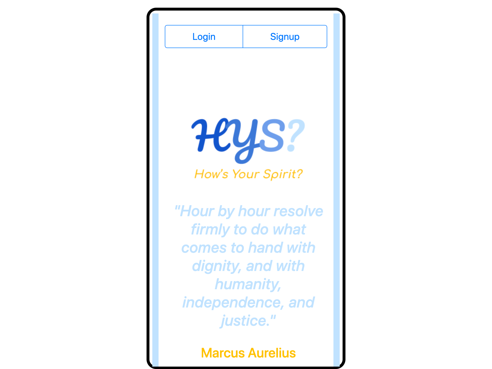

# How's Your Spirit?
### A mood and activity tracker

## Table of Contents

* Description
* Installation
* Known Issues
* License
* Contributors
* Questions and Further Areas for Development

## Description
How’s Your Spirit? (HYS?) is a mood causality tracker that was designed with ease of use, and actionable information at its core.

With HYS? you are able to use our intuitive interface to capture your moods and daily activities. These factors can then be reviewed via an easy to reference UI that visualizes the frequency and intensity of your moods, energy level, and activities that affect them; both positive and negative.

## Installation
Repository at: https://github.com/tristinbarnett/hows-your-spirit

Deployed live at: https://hows-your-spirit.herokuapp.com/

## Known Issues

None

## License

MIT © Ingrid Hoffman, Tristin Barnett, Andrew McIntire

## Contributors

Tristin Barnett - https://github.com/tristinbarnett
* Taskmaster extraordinaire and keeper of the project board
* Database integration, GET/POST, and Deployment Lead
* Assist on other tasks as needed

Ingrid Hoffman - https://github.com/ingridhoffman
* Data wrangler and forcer of things to work
* ReactJS Lead and integration Czar
* Assist on other tasks as needed

Andrew McIntire - https://github.com/imAnonAmi
* Pseudo-code, documentation, flim flam presentation man
* CSS, HTML, “Make it pretty” Lead
* Assist on other tasks as needed

## Questions and Further Areas for Development

-Advanced filtering options including the ability to:

  -Add further user details and segmentation options

  -Review user results vs. anonymized results for all users

  -Filter results by a broader variety of user defined parameters

-Add interactivity to journal entries to enable editing

-Improve validation functionality for dates

-Further causality logging

-Increased integration with other wellness applications

-Increased number of emotional health resources

